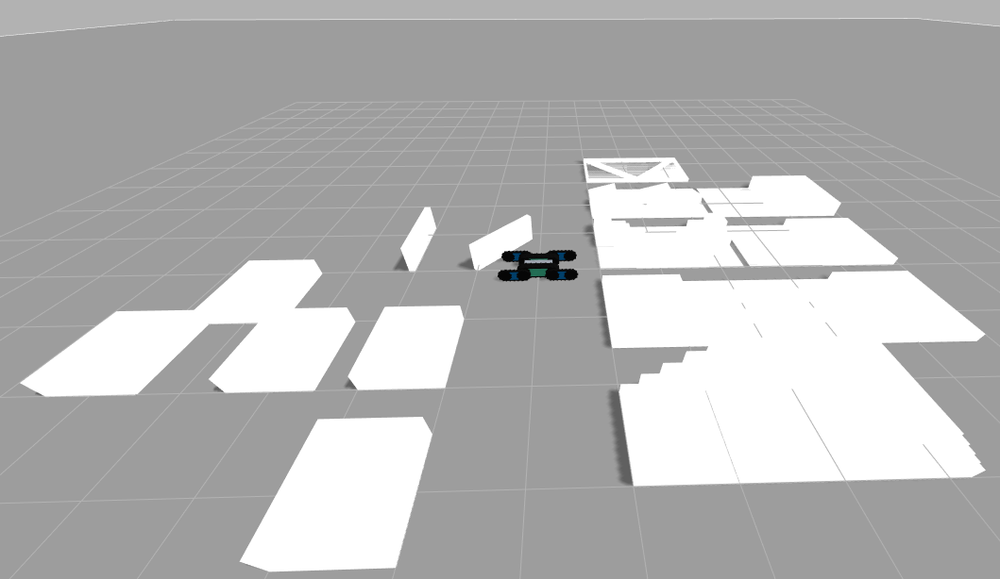
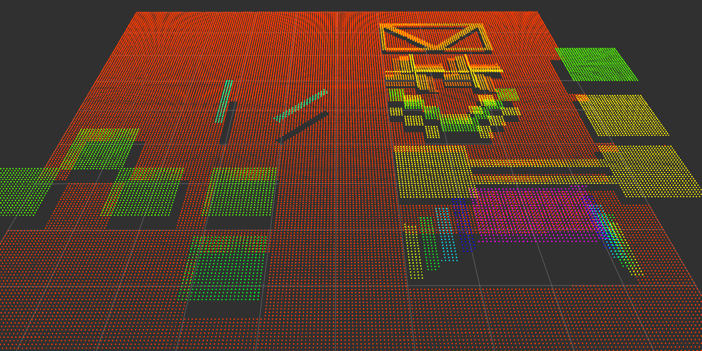

This package publishes PointCloud2 data for Gazebo objects.

- Install Gazebo / Ignition dependencies:

```bash
sudo apt install ignition-fortress
```






```bash
ros2 launch crawler_gazebo model_pointcloud.launch.py
```

## Model Files
Primitive terrain models are located here:

`/gazebo_model`


## World from YAML
An example simulation environment is located here:

`/config/gazebo_environment/benchmark.yaml`

```yaml
robocup_arena:
  objects:
    stepfield_1:  { x: 1.0,  y: 0.0,  z: 0.0, roll: 0, pitch: 0, yaw: 0, scale_x: 1.0, scale_y: 1.0, scale_z: 1.0 }
    continuesramp_1: { x: 1.0, y: 1.5, z: 0.0, roll: 0.0, pitch: 0.0, yaw: 0.0}
    krails_1: { x: 1.0, y: 3.0, z: 0.0, roll: 0.0, pitch: 0.0, yaw: 0.0}

    pallet15_1: { x: 3.5, y: 0.0, z: 0.0, roll: 0.0, pitch: 0.0, yaw: -90.0}
    pallet30_1:  { x: 3.5,  y: 1.5,  z: 0.0, roll: 0, pitch: 0, yaw: -90.0 }
    
    bridge376_1: { x: 1.0,  y: -1.5,  z: 0.0, roll: 0, pitch: 0, yaw: 0 }
    stair45degwithcatwalk_1: { x: 1.0,  y: -3.0,  z: 0.0, roll: 0, pitch: 0, yaw: 0 }
    stair45deg_1: { x: 4.2,  y: -2.1,  z: 0.0, roll: 0, pitch: 0, yaw: 180 }

    wall50single_1: { x: -1.0,  y: 0,  z: 0.0, roll: 0, pitch: 0, yaw: 45 }
    wall50single_2: { x: -2.0,  y: 0,  z: 0.0, roll: 0, pitch: 0, yaw: 90 }
    # wall100single_1: { x: -4.8,  y: -1.2,  z: 0.0, roll: 0, pitch: 0, yaw: 0 }

    30cmstep_1: { x: -1.5,  y: -1.5,  z: 0.0, roll: 0, pitch: 0, yaw: 0 }
    30cmstep_2: { x: -3.0,  y: -1.5,  z: 0.0, roll: 0, pitch: 0, yaw: 0 }
    30cmstep_3: { x: -5.0,  y: -1.5,  z: 0.0, roll: 0, pitch: 0, yaw: 0 }
    30cmstep_4: { x: -4.0,  y: -0.5,  z: 0.0, roll: 0, pitch: 0, yaw: 0 }
    40cmstep_1: { x: -1.5,  y: -3.0,  z: 0.0, roll: 0, pitch: 0, yaw: 0 }
```
- RoboCup single-lane examples:
  - krails_ramp_wall_withstart.yaml
  - continuesramp_ramp_withstart.yaml
  - stepfield.yaml
  - stair.yaml
  - continuesramp.yaml
  - pallet30.yaml

Launch a model-only point cloud environment by passing a YAML file to `arena_yaml:=...`.
Relative `arena_yaml` values are resolved from `crawler_gazebo/config/gazebo_environment/`. When the package is launched from a colcon workspace, the source package is preferred over the installed share directory.

Default benchmark environment:

```bash
ros2 launch crawler_gazebo model_pointcloud.launch.py \
  arena_yaml:=benchmark.yaml
```

Continuous ramp:

```bash
ros2 launch crawler_gazebo model_pointcloud.launch.py \
  arena_yaml:=continuesramp.yaml
```

Continuous ramp with an additional ramp:

```bash
ros2 launch crawler_gazebo model_pointcloud.launch.py \
  arena_yaml:=continuesramp_ramp.yaml
```

Single-lane K-rails ramp wall with start:

```bash
ros2 launch crawler_gazebo model_pointcloud.launch.py \
  arena_yaml:=singlerane/krails_ramp_wall_withstart.yaml
```

Single-lane continuous ramp with start:

```bash
ros2 launch crawler_gazebo model_pointcloud.launch.py \
  arena_yaml:=singlerane/continuesramp_ramp_withstart.yaml
```

Single-lane step field:

```bash
ros2 launch crawler_gazebo model_pointcloud.launch.py \
  arena_yaml:=singlerane/stepfield.yaml
```

Single-lane stair:

```bash
ros2 launch crawler_gazebo model_pointcloud.launch.py \
  arena_yaml:=singlerane/stair.yaml
```

Single-lane continuous ramp:

```bash
ros2 launch crawler_gazebo model_pointcloud.launch.py \
  arena_yaml:=singlerane/continuesramp.yaml
```

Single-lane pallet 30:

```bash
ros2 launch crawler_gazebo model_pointcloud.launch.py \
  arena_yaml:=singlerane/pallet30.yaml
```

Other YAML files can be launched with the same pattern:

```bash
ros2 launch crawler_gazebo model_pointcloud.launch.py \
  arena_yaml:=singlerane/bridge.yaml
```

## Save to PCD File
- Save the raw cloud:

  ```bash
  ros2 run crawler_gazebo cloudmap_to_pcd --ros-args \
    -p input_topic:=/octomap_pointcloud \
    -p output_path:=package://crawler_gazebo/pcd/octomap_pointcloud.pcd \
    -p durability:=transient_local
  ```

- Save the filtered cloud:

  ```bash
  ros2 run crawler_gazebo cloudmap_to_pcd --ros-args \
    -p input_topic:=/octomap_pointcloud/filtering \
    -p output_path:=package://crawler_gazebo/pcd/octomap_pointcloud_filtering.pcd \
    -p durability:=transient_local
  ```

- Save only the points inside an XY range:

  ```bash
  ros2 run crawler_gazebo cloudmap_to_pcd --ros-args \
    -p input_topic:=/octomap_pointcloud/filtering \
    -p output_path:=package://crawler_gazebo/pcd/octomap_pointcloud_filtering_crop.pcd \
    -p durability:=transient_local \
    -p crop_xy:=true \
    -p min_x:=-2.0 \
    -p max_x:=5.0 \
    -p min_y:=-3.0 \
    -p max_y:=2.0
  ```

`crop_xy:=true` enables cropping. Points with `x` outside `[min_x, max_x]` or `y` outside `[min_y, max_y]` are not written to the PCD file.
`package://crawler_gazebo/pcd/...` is resolved from the source `crawler_gazebo` package when it is available; otherwise, it falls back to the installed package's share directory. Set `CRAWLER_GAZEBO_SOURCE_DIR=/path/to/crawler_gazebo` to override the source location.
